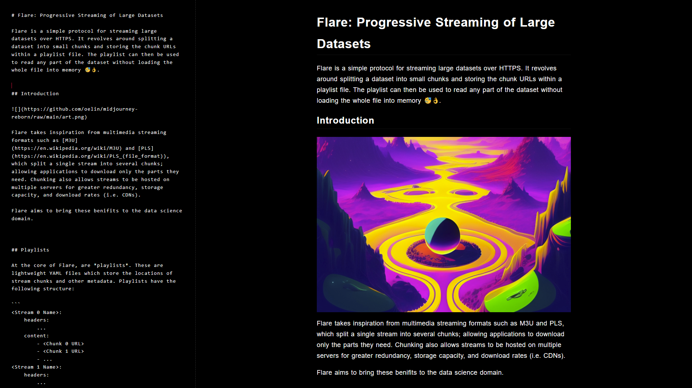

# Sable

A dark, minimal markdown editor for late nights 🌙.




## Installation

```sh
$ git clone https://github.com/oelin/sable
```

```sh
$ cd sable
```
```sh
$ npm i
```

To run the dev server use `npm run dev`, or `npm run build` to create a production build.
